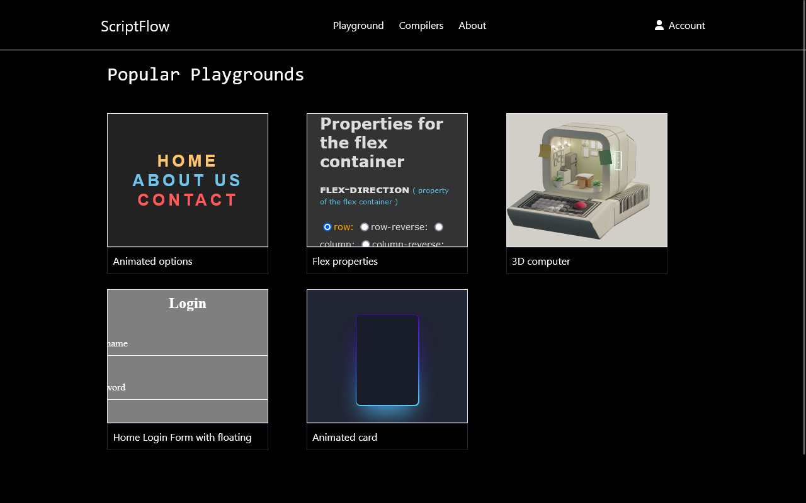
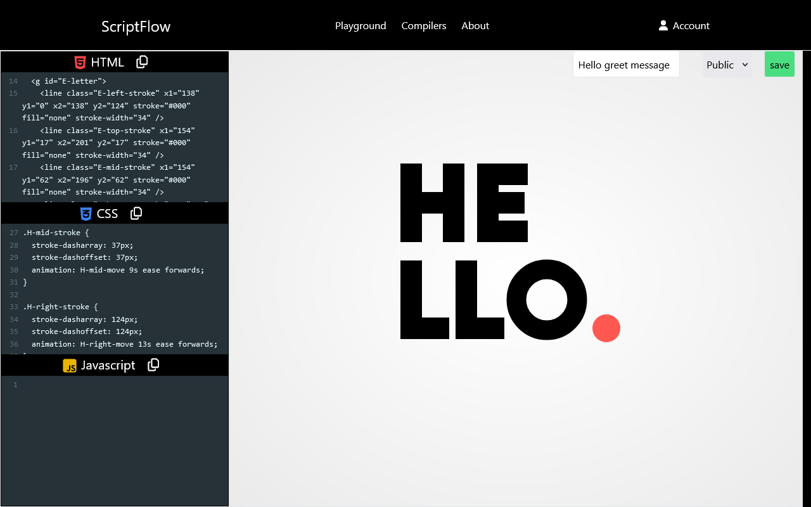
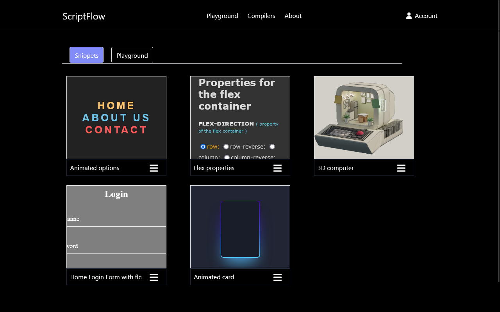
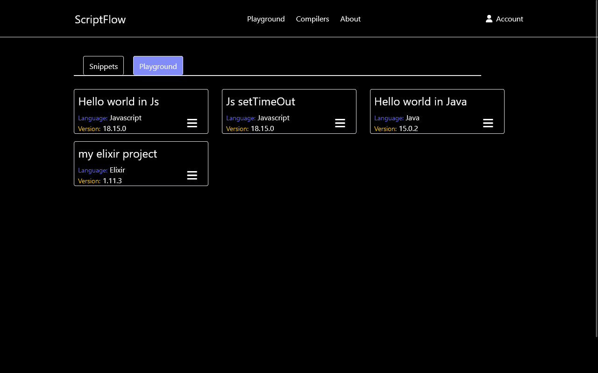
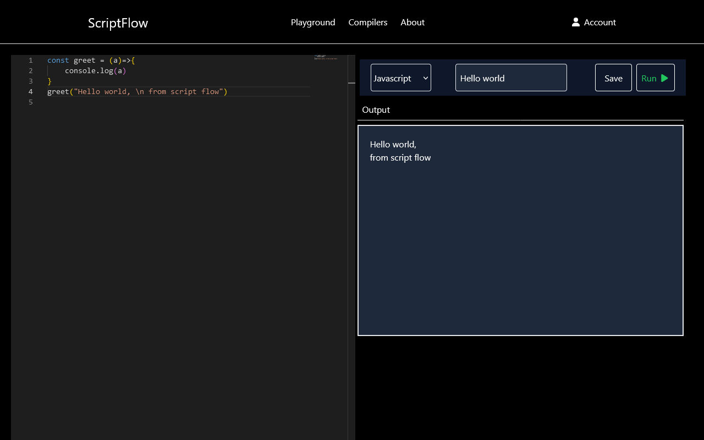

# Script Flow

Script Flow is an online code editor which supports multiple languages.
It is a user-friendly, responsive online application that has been developed with React.

# Script Flow

Script Flow is an online code editor.
It is a user-friendly online web application that has been developed with React.

## About the app

*  Home Page
  

*  HTML-CSS-Js compiler
  

*  Account
   

*  Account code snippets
  

* Compilers
  

## Future improvements

*   Adding sockets for real-time editing.
*   Auto saving to cloud
*   Adding an AI module for code refactoring or debugging (Gemini / OpenAI API)
*   Dynamically place the available languages and their versions
